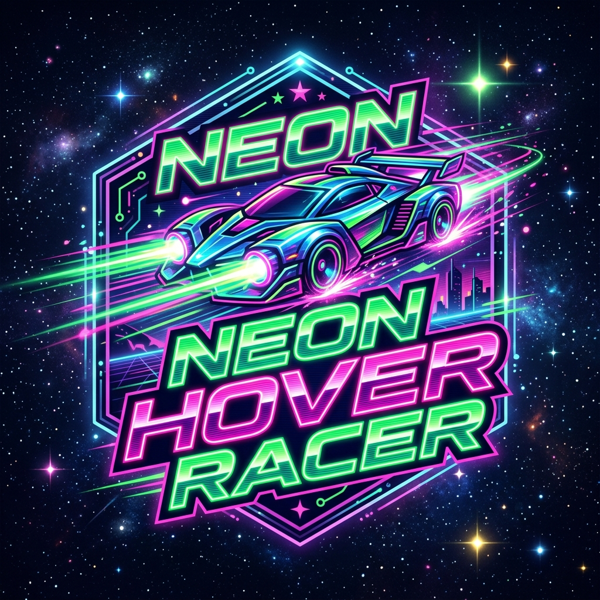

# Neon Hover Racer

  

A fast-paced, 3D endless hover racing game built with Three.js. Dodge obstacles, hit jump ramps, and speed through a neon-lit cyberpunk universe to get the highest score!

## Features

- **3D Graphics:** Built with Three.js, featuring a synthwave aesthetic with neon lights and a dynamic space background.
- **Endless Gameplay:** The game progressively speeds up and generates obstacles infinitely.
- **Physics & Jumping:** Hit ramps to jump over obstacles and gain bonus points.
- **Visual Effects:** Dynamic lighting, particle trails, parallax backgrounds, and smooth camera shaking.
- **High Score Tracking:** Your highest score is saved locally in your browser.

## How to Play

- **W / A / S / D:** Move the hovercar (Accelerate, Brake, Left, Right).
- Avoid the red obstacles.
- Hit the green ramps to jump and earn bonus points.
- The game speeds up the longer you survive!
- Press **Space** or the "REBOOT SYSTEM" button when game over to restart.

## Technologies Used

- HTML5
- CSS3
- JavaScript
- [Three.js](https://threejs.org/) (r128)

## Getting Started

Simply open the `index.html` file in any modern web browser to play the game locally, or host the files on a web server.
